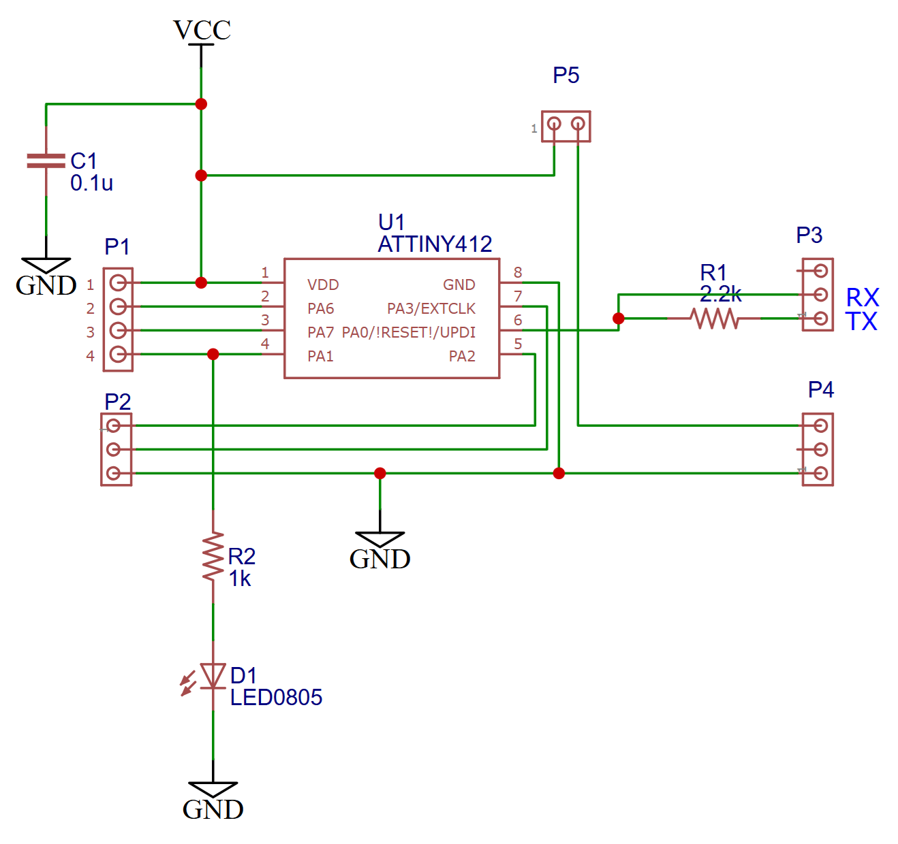

# tinyAVR® 1-series

A minimal example of [UPDI](https://onlinedocs.microchip.com/oxy/GUID-19DFE3E8-6314-4CFE-BA69-1357E28C8092-en-US-1/GUID-A2FD739F-A1D8-4C2F-9482-0B8AF9DCF435.html) programming using a TTL level serial adapter.

* ATtiny412
* Tested with Arduino IDE 2.3.2
* Tested with Arduino 1.8.11

## Arduino IDE Steps

* Install [megaTinyCore](https://github.com/SpenceKonde/megaTinyCore/blob/master/Installation.md)

1. Select board: Tools | [megaTinyCore] | ATtiny412...
2. Select chip: Tools | Chip | ATtiny412
3. Select port: Tools | Port | COM7 (Launch Arduino after USB plugged in)
4. Select programmer: Tools | Programmer | SerialUPDI - SLOW: 57600 baud

Sketch | Upload Using Programmer
