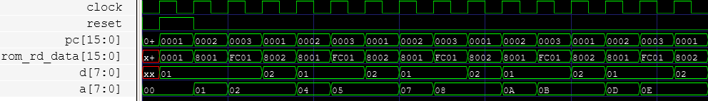
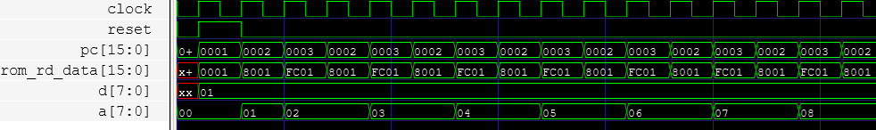

# Gigatron Variant

This is a alternative implementation of the [Gigatron](https://gigatron.io/) instructions set in Verilog. The Gigatron is a minimalist 8-bit retro CPU originally built with [TTL](https://en.wikipedia.org/wiki/Transistor%E2%80%93transistor_logic) logic. It is designed with as few parts as possible.

The implementation is not yet 100% complete. However, it is capable of basic execution and unconditional branching.

## Delay Slot

The official Gigatron is a [pipelined](https://en.wikipedia.org/wiki/Pipeline_(computing)) [Harvard architecture](https://en.wikipedia.org/wiki/Harvard_architecture) CPU. It has the following characteristics:

* Separate code/data memory: instructions and data are stored in independent memories, unlike [Von Neumann](https://en.wikipedia.org/wiki/Von_Neumann_architecture) architectures.
* Fetch/execute pipelining: the next instruction in sequence is fetched while the current one is executing.

Both of these techniques are used to optimize execution performance.

Depending on the design, this type of pipelined architecture can result in a [delay slot](https://en.wikipedia.org/wiki/Delay_slot). This can happen if the program counter is directly connected to the program memory address. The following code snippet illustrates the point:

```
0001    // 0: load A register with constant value 1
8001    // 1: Add constant value 1 to A register
fc01    // 2: Jump to address 1 (previous instruction)
8002    // 3: Add constant value 2 to A register
```

This is the equivalent high level pseudo code that loads A with 1 and adds 1 in an infinite loop:

```
A = 1
while True:
    A = A + 1
A = A + 2
```

The timing diagram below shows how the instruction after the jump (delay slot) unexpectedly executes before the jump:



Notice the A register increases by one prior to the branch, and two during the branch. This happens because the program memory address changes after the program counter is updated with the branch address. This results in a one instruction delay due to the instruction pipeline register.

## Address Forwarding

Is it possible to avoid branch delay slots in a pipelined Harvard architecture? That's what this design attempts to demonstrate. In this design, the instruction memory address bus is driven by a multiplexor. The multiplexor selects one of two inputs, depending on the instruction:

1. Program counter (PC) - normal, no-branch instruction
2. Branch address - branch instruction (branch taken)

In both cases, the program counter is loaded with the rom address + 1 on the rising clock edge. I believe this a form of address [forwarding](https://www.youtube.com/watch?v=aVEA3WKyfYs). It's a technique of sending values from an earlier pipeline stage to a later pipeline stage. Using the same program snippet from above, the timing diagram below shows how forwarding avoids the potential branch delay slot:



Notice the A register increments by one every other cycle, which is what we would expect. This design borrows from techniques described in Chapter II of the classic book by John Mick and James Brick: [Bit-Slice Microprocessor Design](http://www.bitsavers.org/components/amd/bitslice/Mick_Bit-Slice_Microprocessor_Design_1980.pdf). Specifically, pages 13-15 explain how pipelining and appropriate wiring of an "incrementer" achieves zero side effect branching.

Forwarding does introduce some complexity. In this case, an additional multiplexor is needed select the next instruction address source. In a discrete design like the Gigatron, minimizing parts is the first priority, so a simpler design with a delay slot makes sense. It is also possible that the forwarding multiplexor increases propagation delays, reducing the maximim reliable clock rate.
