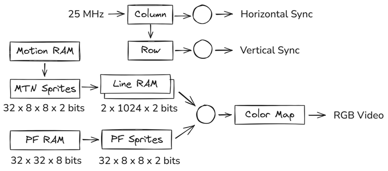

# VGA Sprites

A lightweight sprite renderer in Verilog. Design is similar to coin-op video arcade machines during the
[golden age of arcade video](https://en.wikipedia.org/wiki/Golden_age_of_arcade_video_games). Resolution is limited to 256 x 200
pixels driving a 640 x 480 60 Hz VGA monitor. Each visible pixel is 2 x 2 VGA pixels to cover most of the screen.

## Components

- VGA sync signal generator
- Sprite renderer: 32 x 30 fixed playfield sprites, 16 motion sprites
- Lightweight, high speed 16-bit CPU optimized small code size
    - Each instruction is exactly one byte, one clock cycle, 25 MHz clock

## Current status:

- Working [Lunar Lander](https://en.wikipedia.org/wiki/Lunar_Lander_(video_game_genre)) physics model
- StackMachine 12-bit CPU, 512 bytes program memory, 512 x 16bit data memory
- 679/1280 LCs, 7/16 RAM blocks, Timing estimate: 67.47 MHz
- I/O functional, Single motion sprite

Next steps:

- Multiple motion sprites

## Sprite Rendering



A full framebuffer would require significant memory, which was cost prohibitive back in the day. Instead, the screen is tiled using a fixed pallete of 8 x 8 pixel sprites. Pixels are limited to two bits, representing 3 visible colors and black or transparent in the case of motion sprites. A color map is then applied to generate RGB signals.

Background playfield sprites are rendered at fixed locations. A limited number of motion sprites, up to 16 in many games, are rendered into a line buffer RAM. Line buffer pixels are rendered on top of playfield pixels giving the illusion of depth during each horizontal scan line. The CPU need only update playfield and motion sprite locations before the next vertical interrupt.

## CPU


12-bit stack machine with internal call stack. Stack is 4 words deep, labeled S3-S0, with S0 as top of stack.
The following auxilliary registers are included to improve performance:

- PC: 12 bit program counter

Instruction Set

Each instruction is exactly 1 byte, single cycle execution. Instruction format:

- 00000000: No operation

- 1ddddddd: Load immediate, sign extended
- 01dddddd: Load immediate, S0 shifted left 6 bits: S0 = (S0 << 6) | d

OPS_LOAD
- 00000001: Load word from memory using S0 as address: S0 = mem[S0]
- 00000010: Swap: S0 = S1, S1 = S0

OPS_STORE
- 00010000: Store to memory: mem[S0] = S1
- 00010001: Print (TestBench only)

OPS_ALU
- 00100000: ADD: S0 = S1 + S0
- 00100001: SUB: S0 = S1 - S0
- 00100010: AND: S0 = S1 & S0
- 00100011: OR: S0 = S1 | S0
- 00100100: XOR: S0 = S1 ^ S0
- 00100101: Shift left 1: S0 = S0 << 1
- 00100110: Logical shift right 1: S0 = S0 >> 1
- 00100111: Arithmetic shift right 1: S0 = S0 >> 1, S0[11] = S0[10]
- 00101000: Less than: S0 = S1 < S0

OPS_JUMP
- 00110000: Unconditional jump: PC = S0
- 00110001: Jump if zero: PC = S0 if S1 == 0
- 00110010: Jump if not zero: PC = S0 if S1 != 0
- 00110011: Call: stack.push(PC), PC = S0
- 00110100: Return: PC = stack.pop()

## Compiler

- A lightweight [compiler](roms/Compiler.py) and [code generator](roms/CodeGenerator.py) translate high live, C-like code into [machine code](roms/code.txt) suitable for execution by the CPU.

## Resource Utilization

The code runs on a [Nandland Go Board](https://nandland.com/the-go-board/) with a Lattice [ICE40](https://www.latticesemi.com/ice40) HX1K FPGA containing 1280 LCs and 16 4kbit RAM blocks (8 kBytes total).

- 1 4kbit BRAM (2048 x 2 bits): 32 8x8 motion pixel sprite table, 4 colors/pixel (2 bits each)
- 1 4kbit BRAM (2048 x 2 bits): 32 8x8 playfield pixel sprite table, 4 colors/pixel (2 bits each)
- 1 4kbit BRAM (2048 x 2 bits): dual port line RAM, ping-pong buffer stores next line for motion objects
    - Two buffers, 1024 x 2 bits each, alternate each line
- 2 4kbit BRAM (1024 x 8 bits): 32 x 30 fixed playfield sprites
    - address: row[4:0] << 5 | column[4:0]
- 1 4kbit BRAM (512 x 8 bits): CPU instruction ROM
- 2 4kbit BRAM (512 x 16 bits): CPU RAM
- 8/16 BRAMs used

## Simulation

[Icarus Verilog](http://iverilog.icarus.com/) is used for simulation, specifically, [Icarus Verilog for Windows](https://bleyer.org/icarus/). The test bench is in contained in TestBench.v. Run simulation using:

```
make test
```

## Synthesis

[Project IceStorm](https://clifford.at/icestorm) open source tools were used for synthesis. Synthesis is known to work on [WSL](https://docs.microsoft.com/en-us/windows/wsl/install) Ubuntu running on Windows 11. WSL requires [usbipd](https://devblogs.microsoft.com/commandline/connecting-usb-devices-to-wsl) to allow WSL Ubuntu to access the USB for programming.

Alternatively, [OSS Cad Suite](https://github.com/YosysHQ/oss-cad-suite-build) contains pre-built binaries for Windows, which might require some USB driver adjustments to work properly. Both solutions are described here.

### Windows Native

* Install [OSS Cad Suite](https://github.com/YosysHQ/oss-cad-suite-build)
* Run ```oss-cad-suite\environment.ps1``` or ```oss-cad-suite\environment.bat``` to set up paths and environment variables

In the event that iceprog fails with error ```Can't find iCE FTDI USB device (vendor_id 0x0403, device_id 0x6010).```, it is necessary to replace USB drivers using [Zadig](https://zadig.akeo.ie/) as mentioned in this [issue](https://github.com/YosysHQ/icestorm/issues/141). I found that replacing default Windows drivers with WinUSB as mentioned [here](https://gojimmypi.blogspot.com/2020/12/ice40-fpga-programming-with-wsl-and.html) works, whereas libusbK results in a silent failure. Step by step instructions are available on [Adafruit](https://learn.adafruit.com/adafruit-ft232h-breakout/windows-setup).

Exercise extreme caution when using Zadig! The wrong USB driver could be accidentally wiped out!

### Windows Subsystem for Linux (WSL)

The following command will perform synthesis and generate the bitstream suitable for programming the FPGA:

```
make
```

USB support on WSL requires [usbipd](https://devblogs.microsoft.com/commandline/connecting-usb-devices-to-wsl) for device programming in WSL. To connect a USB device to WSL Ubuntu, the following commands must be executed from an **administrator*- command prompt on Windows:

```
usbipd wsl list
```
```
usbipd wsl attach --busid <busid>
```

Where busid is the appropriate USB bus ID from the wsl list command above. The device should appear in WSL Ubuntu using ```lsusb```.

Alternatively, Windows Powershell in VSCode is quicker. Open a Windows Powershell terminal in VSCode using Terminal | New Terminal and run the following command to list available usb devices:

```
.\usb.bat
```

Then run ```usbipd wsl attach --busid <busid>``` as described above.

The board can be programmed from WSL Ubuntu using:

```
make sudo-prog
```

Note that WSL needs sudo, otherwise this error might result:

```
Can't find iCE FTDI USB device (vendor_id 0x0403, device_id 0x6010 or 0x6014).
```