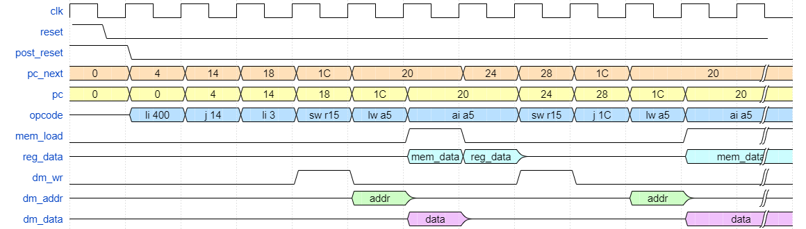

# Risc-V Experiments

```
sudo apt install gcc-riscv64-unknown-elf
```

* PDF [spec](https://riscv.org/wp-content/uploads/2017/05/riscv-spec-v2.2.pdf)
* Risc-V [instructions](https://msyksphinz-self.github.io/riscv-isadoc/html/rvi.html)
* [Registers](https://en.wikichip.org/wiki/risc-v/registers)

## Basic Timing

* [Harvard architecture](https://en.wikipedia.org/wiki/Harvard_architecture)
* Synchronous program/data memory

Timing diagram created using [WaveDrom](https://wavedrom.com/tutorial.html).


